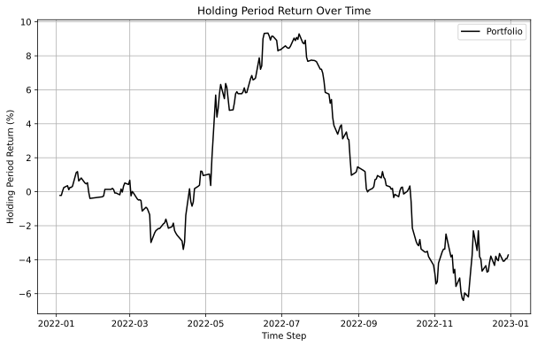
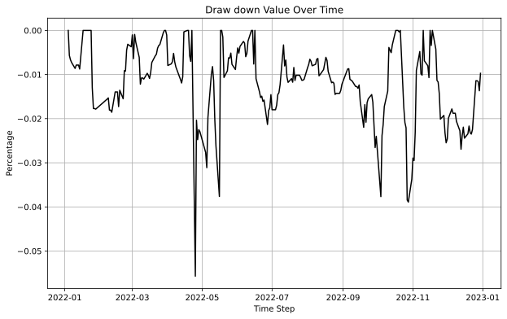
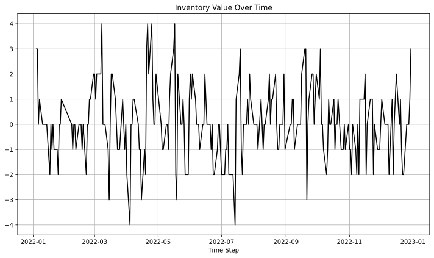
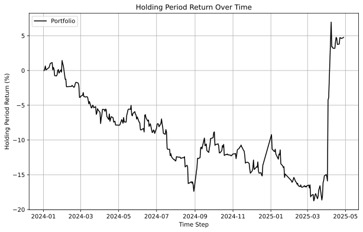
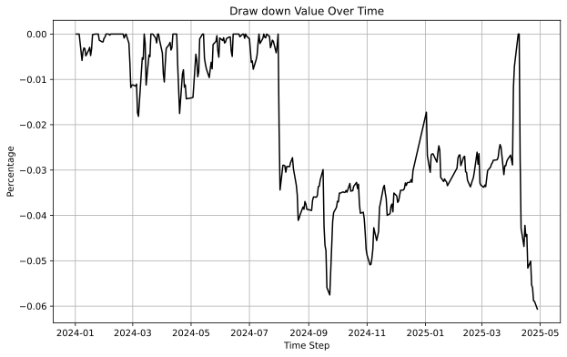
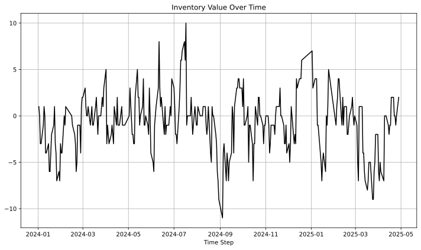

# Z-Bounce

## Trading Through Statistical Price Oscillations

> Capture full oscillation cycles by trading at extreme z-score levels and exiting at opposite extremes

## Abstract

This project develops a statistical boundary-based trading strategy for VN30 futures using rolling z-scores to identify extreme price deviations. The core hypothesis is that extreme price movements often reflect temporary imbalances rather than lasting trends, and that deeper deviations are more likely to be followed by stronger counter-moves.

The strategy increases position size as the z-score moves further into extreme territory and exits when the price reaches the opposite boundary, aiming to capture full oscillation cycles. Forced sale scenarios are accounted for by incorporating additional fees into the asset's valuation.

## Introduction

VN30 futures prices frequently fluctuate within short-term statistical ranges. When price moves far from its rolling average, measured by z-score, it may indicate temporary imbalance between buyers and sellers. Larger deviations often lead to stronger corrective movements.

Rather than exiting at the mean, this strategy holds positions until the price travels to the opposite extreme, capturing the full oscillatory movement. Exposure increases when deviations deepen, allowing the strategy to respond proportionally to the strength of the signal while remaining constrained by available capital.

## Hypothesis

When VN30 futures price deviates significantly from its short-term statistical mean (measured by rolling z-score), the probability of a large counter-move toward the opposite extreme increases. Therefore, entering positions at extreme z-score levels and holding until an opposite extreme appears captures full oscillation cycles.

**Trading Logic:**

- **Entry Signal:** Position opens when rolling z-score crosses extreme thresholds (e.g., ±z_entry)
- **Exit Signal:** Position closes when rolling z-score crosses the opposite extreme threshold (e.g., ±z_exit
  )
- **Position Direction:** Determined by z-score sign (negative z-score → long, positive z-score → short)

The z-score is calculated as:
$$z\text{-}score = \frac{price - MA(price)}{STD(price)}$$

where MA is the moving average and STD is the standard deviation over a rolling window.

## Data

- Data source: Algotrade database
- Data asset: VN30 Futures (VN30F1M - 1-month contract)
- Data period: from 2022-01-01 to 2025-04-29
- Data frequency: 1-minute OHLC (Open, High, Low, Close) data
- Transaction fee: 0.4 / 2 per side

### Data collection

- The 1-minute price data is collected from Algotrade database
- Data is collected using the script `data_loader.py`
- Data is stored in the `data/is/` folder (in-sample) and `data/os/` folder (out-of-sample)

## Implementation

### Environment Setup

1. Set up python virtual environment

```bash
python -m venv venv
source venv/bin/activate # for Linux/MacOS
.\venv\Scripts\activate.bat # for Windows command line
.\venv\Scripts\Activate.ps1 # for Windows PowerShell
```

2. Install the required packages

```bash
pip install -r requirements.txt
```

3. (OPTIONAL) Create `.env` file in the root directory of the project and fill in the required information. The `.env` file is used to store environment variables that are used in the project. The following is an example of a `.env` file:

```env
DB_NAME=<database name>
DB_USER=<database user name>
DB_PASSWORD=<database password>
DB_HOST=<host name or IP address>
DB_PORT=<database port>
```

### Data Collection

#### Option 1. Download from Google Drive

Data can be download directly from [Google Drive](https://drive.google.com/drive/folders/1R84iCUwO-t_aQxzGqmNYGrtEezPttzSK?usp=sharing). The data files are stored in the `data` folder with the following folder structure:

```
data
├── is
│   └── VN30F1M_data.csv
└── os
    └── VN30F1M_data.csv
```

You should place this folder to the current `PYTHONPATH` for the following steps.

#### Option 2. Run codes to collect data

To collect data from database, run this command below in the root directory:

```bash
python data_loader.py
```

The result will be stored in the `data/is/` and `data/os/`

### In-sample Backtesting

Specify period and parameters in `parameter/backtesting_parameter.json` file.

```bash
python backtesting.py
```

The results are stored in the `result/backtest/` folder.

### Optimization

To run the optimization, execute the command in the root folder:

```bash
python optimization.py
```

The optimization parameter are store in `parameter/optimization_parameter.json`. After optimizing, the optimized parameters are stored in `parameter/optimized_parameter.json`.

### Out-of-sample Backtesting

[TODO: change the script name to out_sample_backtest.py or something like that]: #

To run the out-of-sample backtesting results, execute this command

```bash
python evaluation.py
```

[TODO: change the name of optimization folder to out-of-sample-backtesting or something like that]: #

The script will get value from `parameter/optimized_parameter.json` to execute. The results are stored in the `result/optimization` folder.

## In-sample Backtesting

Running the in-sample backtesting by execute the command:

```bash
python backtesting.py
```

### Evaluation Metrics

- Backtesting results are stored in the `result/backtest/` folder.
- Used metrics:
  - Sharpe ratio (SR)
  - Sortino ratio (SoR)
  - Maximum drawdown (MDD)
- We use a risk-free rate of 6% per annum, equivalent to approximately 0.023% per day, as a benchmark for evaluating the Sharpe Ratio (SR) and Sortino Ratio (SoR).

### Parameters

### In-sample Backtesting Result

- The backtesting results are constructuted from 2022-01-01 to 2023-01-01.

```
| Metric                 | Value                              |
|------------------------|------------------------------------|
| Sharpe Ratio           | 2.1049                             |
| Sortino Ratio          | 4.0566                             |
| Maximum Drawdown (MDD) | -0.1864                            |
| HPR (%)                | 93.02                              |
| Monthly return (%)     | 6.31                               |
| Annual return (%)      | 86.99                              |
```

- The HPR chart. The chart is located at: `result/backtest/hpr.svg`
  
- Drawdown chart. The chart is located at `result/backtest/drawdown.svg`
  
- Daily inventory. The chart is located at `result/backtest/inventory.svg`
  

## Optimization

Z-score thresholds (entry and exit levels) are optimized using the in-sample data to maximize risk-adjusted returns. The configuration for optimization is stored in `parameter/optimization_parameter.json`. You can adjust the range of parameters for the z-score entry and exit thresholds. A random seed is used for reproducibility. The optimized parameters are stored in `parameter/optimized_parameter.json`.

The optimization process can be reproduced by executing:

```bash
python optimization.py
```

The currently found optimized parameters with seed `2025` are:

```json
{
  "window_size": 16,
  "threshold": 3.0
}
```

## Out-of-sample Backtesting

- Specify the out-sample period and parameters in `parameter/backtesting_parameter.json` file.
- The out-sample data is loaded on the previous step. Refer to section [Data](#data) for more information.
- To evaluate the out-sample data run the command below

```bash
python evaluation.py
```

### Out-of-sample Backtesting Result

- The out-sample backtesting results are constructuted from 2024-01-02 to 2025-04-29.

```
| Metric                 | Value                              |
|------------------------|------------------------------------|
| Sharpe Ratio           | -0.1319                            |
| Sortino Ratio          | -0.2020                            |
| Maximum Drawdown (MDD) | -0.3265                            |
| HPR (%)                | -14.22                             |
| Monthly return (%)     | -1.03                              |
| Annual return (%)      | -12.12                             |
```

- The HPR chart. The chart is located at `result/optimization/hpr.svg`.
  

- Drawdown chart. The chart is located at `result/optimization/drawdown.svg`.
  
- Daily inventory. The chart is located at `result/optimization/inventory.svg`
  

## Reference

[1] ALGOTRADE, Algorithmic Trading Theory and Practice - A Practical Guide with Applications on the Vietnamese Stock Market, 1st ed. DIMI BOOK, 2023, pp. 52–53. Accessed: March 3, 2026. [Online]. Available: [Link](https://hub.algotrade.vn/knowledge-hub/mean-reversion-strategy/)
